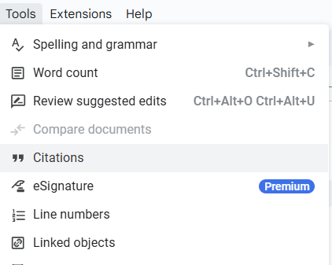

# Inserting References

Intro text: what is a reference, and why would a user need one? In this example, we'll take two webpages from NNGroup, entitled 10 heuristics. Explain how GDocs has a reference tool that allows users to add references, which will then generate a References page for your report. 

## Steps

1. Locate the page and copy URL for [10 heurisistics](NNwebsite1)

2. Open Google Drive (image needed) (note needed about different ways and may need to sign in to access it)

3. Create a new Google document (image needed)

4. Click on Tools, Citations (we'll need conventions for when there's a dropdown; does image need cropping? does it need an annotation?)

